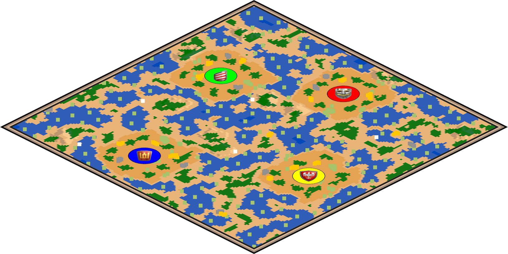
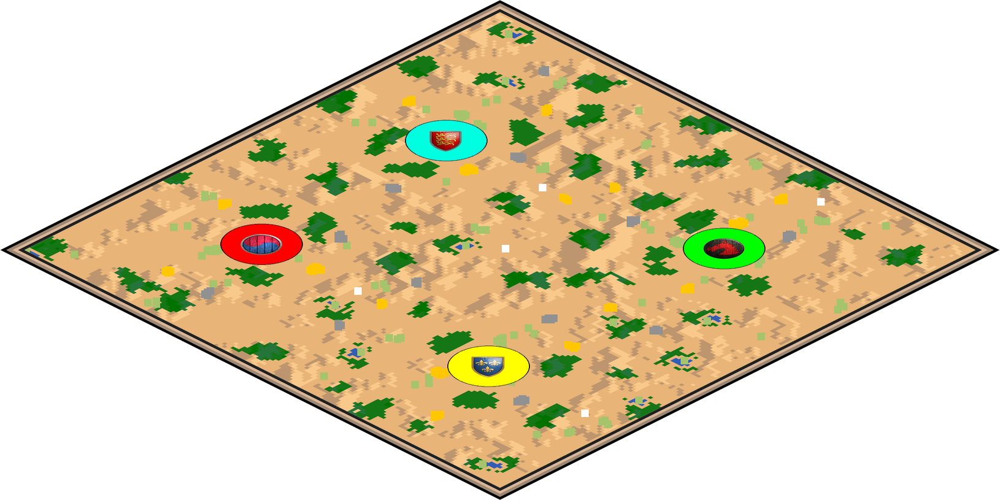
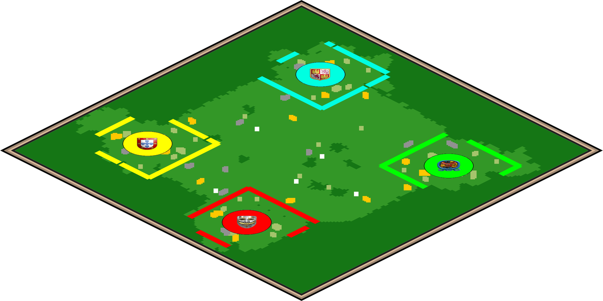
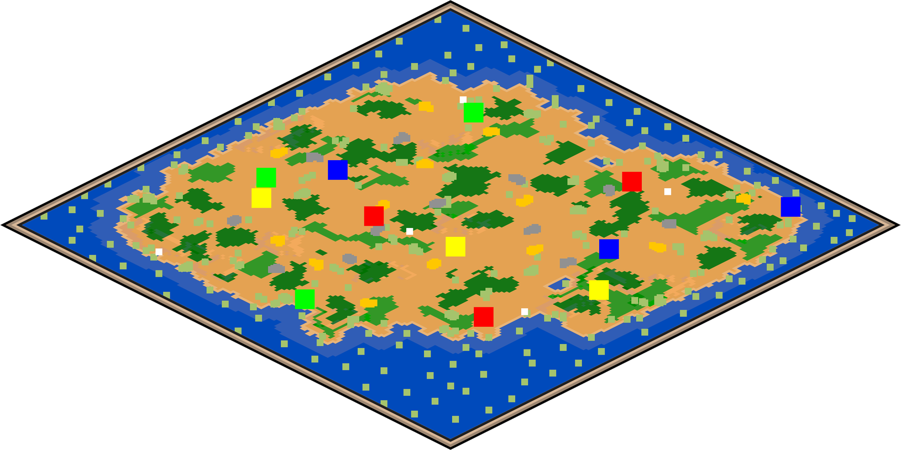

# McMinimap
 
McMinimap generates static Age of Empires 2 mini-maps using recorded game data, which I use to autopopulate my [YouTube Channel](https://www.youtube.com/@buttonbashofficial) intros!



# Features

 - Adjustable sizes for everything!
 - Adjustable 360 degree map orientation
 - "Square" or "Pixel" object modes
 - Easily show/hide individual resources
 - Optional Civ Emblem TC marker
 - Adjustable orthographic ratio (map tilt)
 - Elevation
 - Adjustable borders
 - Usable as a Python module (call it from other code)
 - Usable as a CLI (run locally)



# Install

```bash
pip install -r requirements.txt
```

# Library usage (import)

```python
from McMinimap import RenderSettings, render_minimap_png_bytes

settings = RenderSettings(
    object_mode="square",
    player_tc_marker="none",
    angle=45,
    multiplier_integer=9,
    orthographic_ratio=2,
    border_spacing=4,
    draw_cliffs=True,
    draw_walls=True,
    rotate_walls_with_canvas=True,
    draw_gaia_objects=True,
    draw_player_objects=False,
)

png_bytes = render_minimap_png_bytes("path/to/scenario.aoe2scenario", settings=settings)
with open("minimap.png", "wb") as f:
    f.write(png_bytes)
```

# CLI usage (run locally)

```bash
python McMinimap.py --input "path/to/scenario.aoe2scenario" --output minimap.png
```

Common options:

```bash
python McMinimap.py --input "path/to/scenario.aoe2scenario" --output minimap.png ^
  --object_mode square ^
  --player_tc_marker none ^
  --angle 45 ^
  --multiplier_integer 9 ^
  --orthographic_ratio 2 ^
  --border_spacing 4 ^
  --draw_cliffs --draw_walls --rotate_walls_with_canvas --draw_gaia_objects --no-draw_player_objects
```

# Input file support

`get_match()` in `McMinimap.py` only accepts the extensions below (anything else raises `ValueError`).

**Recorded games** (tile/object data from the replay header via **mgz-fast**):

- Age of Kings (`.mgl`)
- The Conquerors (`.mgx`)
- Userpatch 1.4 (`.mgz`)
- Userpatch 1.5 (`.mgz`)
- HD Edition ≥ 4.6 (`.aoe2record`)
- Definitive Edition (`.aoe2record`)

**Scenarios — Definitive Edition** (via **AoE2ScenarioParser**):

- `.aoe2scenario`

**Scenarios — classic** (via **McMinimapLegacy**, trimmed AgeScx):

- Age of Kings (`.scn`)
- The Conquerors (`.scx`)

# Usage

Use either the **library API** (recommended for integration) or the **CLI** (recommended for local runs).



# Thanks

Thankyou to **Marfullsen**'s excellent [AOE2 Minimap Generator](https://github.com/Marfullsen/AoE2-minimap-generator), on which this script was based on. In the end much got rewritten, but it certainly served as the inspiration and a great starting point.

Of course thanks to **happyleaves**'s [aoc-mgz](https://github.com/happyleavesaoc/aoc-mgz), which is key in parsing AOE2's recorded games.


